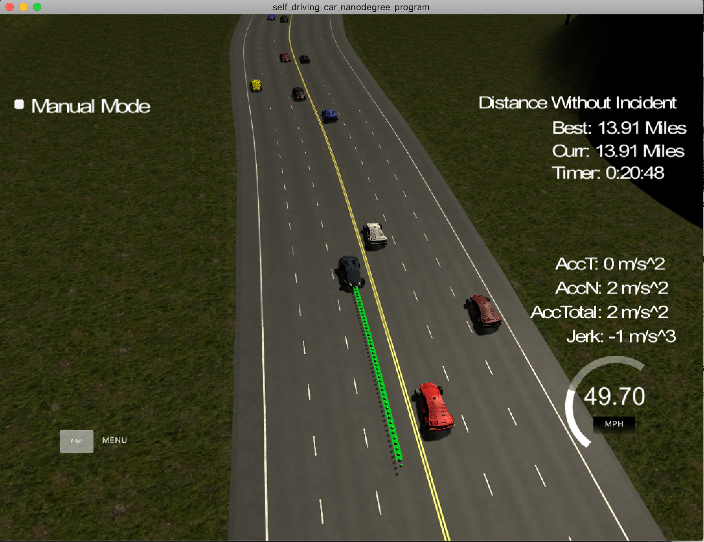

# CarND-Path-Planning-Project
Self-Driving Car Engineer Nanodegree Program

## Introduction
This repository contains code for the Path Planning project of the Self-Driving Car Engineer Nanodegree Program on Udacity.
It can be run using Term3 Simulator, available [here](https://github.com/udacity/self-driving-car-sim/releases/tag/T3_v1.2)

##Project structure
The whole path planner is grouped into several modules:
 * `Map` - responsible for loading the map and doing coordinate transformations
 * `Planner` - main planner, finite state machine that finds the next trajectory
 * `Cost` - calculates efficiency of the trajectories
 * `SensorFusion` - responsible for analyzing data of surrounding vehicles and finding nearby vehicles
 * `Predictions` - responsible for estimating trajectories of other vehicles
 * `TrajectoryGenerator` - generates the trajectories based on desired future position 
   
A few structures are used thorough the project:
 * `Car` - represents 'our' car and it's state (position, velocity)
 * `OtherCar` - represents car detected by SensorFusion, with it's historical data about position and speed (up to 100 entries) and predicted future trajectories
 * `Trajectory` - represents the trajectory both of our and other cars 

The following sections present more details about each project.

### Map
The map module (`map.cpp` /  `map.h`) provides access to the map data for other modules. It is used for coordinate transformations (Frenet <-> XY).
It's extracted from starter code, without changes.

### Planner
The main module, responsible for the whole behaviour of our car. It is modelled as finite state state machine, with the following states:
* `Follow` - represents keep lane/follow other situation. Car follows the lane reaching either maximum speed or the speed of vehicle in front of it
* `ChangeLeft` - switch lane to the left
* `ChangeRight` - switch lane to the right

State | Possible next states | Comments
------------ | ------------- | ------------- 
| `Follow `| `Follow` | |
| | `ChangeLeft` |  |
| | `ChangeRight` |  |
| `ChangeLeft` |  `ChangeLeft` | When the maneuver is in progress |
|           | `Follow `| When car has switched lanes |
|           | `ChangeRight` | ABORT maneuver action. Comes with PENALTY |
| `ChangeRight` |  `ChangeRight` | When the maneuver is in progress |
|           | `Follow` | When car has switched lanes |
|           | `ChangeLeft` | ABORT maneuver action. Comes with PENALTY |
            
Going from `ChangeLeft` to `ChangeRight` or `ChangeRight` to `ChangeLeft` are the _abort maneuver_ actions.
They came with cost penalty meaning that they won't be executed unless other trajectories will lead to collision.
They are meant for emergency situations, like changing from left to middle while at the same time other car changes from right to middle (and predictions did not handle that).
    
Regardless of the state vehicle is in, planner generates a set of possible trajectories based on possible next states (`Planner::CalculateOptions`). 
Process of generating trajectory is based on the following steps:
1. Define target lane
2. Evaluate desired vehicle speed
3. Generate candidate trajectory

Each trajectory is then passed to cost analyzer, and the one winning one is passed to vehicle controller.

#### Evaluating desired vehicle speed
For each trajectory we need to evaluate velocity of our vehicle. The velocity should meet basic criteria:
* Be as close to speed limit,
* Not cause a collision
 
The algorithm of finding the target velocity is contained in `Planner::UpdateDesiredVelocity` and can be described as:
1. Get the cars behind and ahead of us on our current lane and lane we want to to be
2. If the car _ahead_ of us is less than 10meters away, EMERGENCY BRAKE: lower speed by `2*DesiredVelocityChange`
3. Otherwise, if the car _ahead_ of us is less than 20 meters, BRAKE with HIGH force: lower speed by `1.5*DesiredVelocityChange`
4. Otherwise, if the car _behind_ us is less than 10 meters away, SPEED UP by `1.8*DesiredVelocityChange`
5. Otherwise, if the car _ahead_ of us is less than 40 meters away, match it's velocity with maximum `DesiredVelocityChange` increment/decrement
6. Otherwise, if our speed is below desired speed, accelerate by `DesiredVelocityChange`

`DesiredVelocityChange` is the global simulation parameter, it was set to 5m/s.

### Cost evaluation
Each candidate trajectory is passed to `Cost::calculateCost` for evaluation.
Cost has the following factors:
1. Collision - trajectory that would lead to collision receives super high penalty 
2. Efficiency - evaluate possible speed on desired lane. Closer the speed is to desired velocity, lower the cost
3. Lane change  - we don't want our car to switch lanes constantly. This adds a penalty if desired lane is current lane. Additionally, a small penalty is added if desired lane is different than middle: We want to encourage car to get into middle lane if it is efficient, as this gives us more possibilities in the future.
4. Penalty - if the trajectory for an emergency one, add it's penalty so it won't be chosen unless others are colliding.  

####Collision detection
Collision detection is critical factor for evaluating trajectories. We don't want to choose a trajectory that would lead to collision.
The process is defined in `Cost::calculateCollisionCost` and can be described as follows:
1. Get the cars (from `SensorFusion`) ahead and behind us on our lane
2. For each of the cars, analyze each point of its trajectory matched with our trajectory (so predicted state in the future)
    * Calculate distance between our and other trajectory
    * If the distance is lowe than 20m, trajectory is colliding
    
Note that this calculation is simplified as it basically treats cars as circles (since only euclidian distance is used). As a consequence, car drives rather conservatively, needing a lot of space to change lanes. No aggresive merges here.
Additionally, hitting a car on current lane is less penalized than hitting after changing. Emergency braking is already uncomfortable, we don't want to add additional lateral forces to the process.

###Sensor Fusion
`SensorFusion` keeps track of the other vehicle on road. Each time we get the new set of data, we:
1. Update current state of other car
2. Add the state to history of other car
3. Predict the trajectory of other car

History is capped at 100, meaning old entries are removed.

`SensorFusion` provides a set of utility functions for finding the closet vehicles ahead/behind our car.

###Predictions
Prediction module is every time we get the new SensorFusion data to evaluate where the other cars will be in the future.
Future horizon is defined globally (`Helpers, LookForward`) as 50 ticks, which corresponds to 1s.

It uses a simple constant-velocity model, evaluating x and y position based on vx and vy values.

During development other model was also used, which calculated acceleration based on history and used that. Unfortunately the data fusion feeds us led to huge errors, lowering collision detection abilities.
This is, however, a huge room for improvement. 
   
### Trajectory generator
Trajectory is generated for the desired velocity and lane (`TrajectoryGenerator::getTrajectory`).
Generation is done using spline method, similar to one described in the project walkthrough:
1. The the part of last non-consumed trajectory 
2. Get last two points of (1) as start, or use car position if path is shorter than 2 elements
3. Define the target points as [+30m, desired lane], [+60m, desired lane], [+90m, desired lane], staring from last point of (1)
4. Calculate spline that goes through (1) and (3)
5. Calculate x_change based on desired velocity
6. Add spline points to (1), separated by x_change so that list contains 50elements (1s)
    
The biggest change in the algorithm is that only 10 points of previous path are taken into account. This allows for faster reaction, while still maintaining smoothness.

The spline method seems to give good enough results in terms of comfort, so implementation of JMT was not considered here. 

## Wrap up
This was a hard one! Finding the correct set of coefficients _was_ a challenge, but finally car is able to do pretty good:
 

There are still occasional glitches, especially that other cars sometimes like to change lanes directly in front of us or are busy texting ;) and hit us from behind (even if they could brake).

The collision algorithm could be further improved by using real car shape (or at least rectangle) instead of simple oval.
Predictions could also be further improved by taking non-linearities into account. One possible way could be to get the spline matching history and extrapolate on that.
